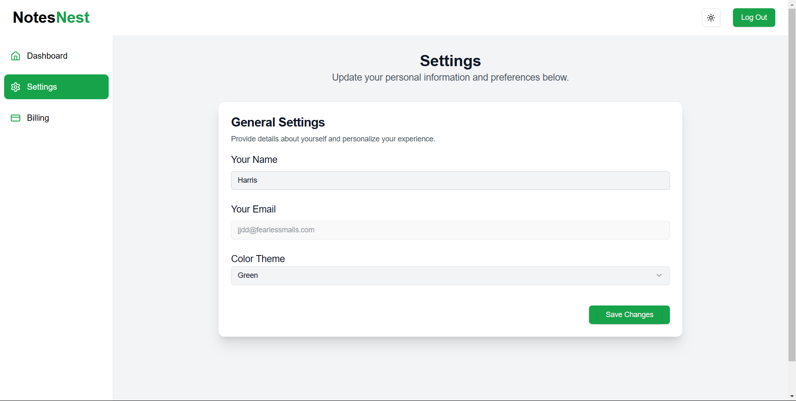
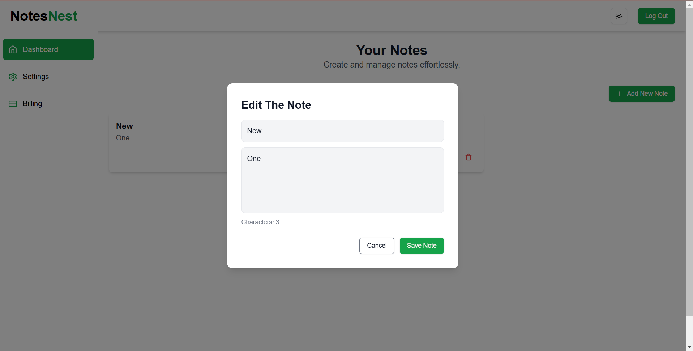
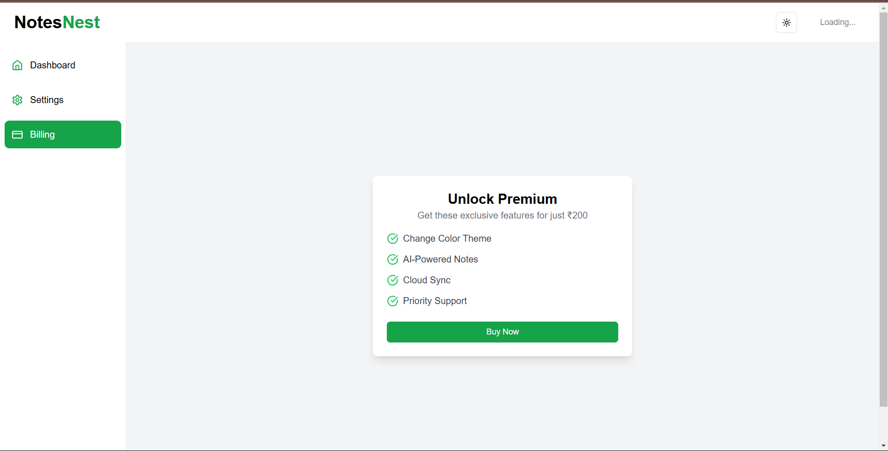
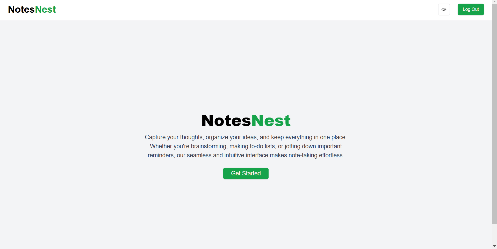
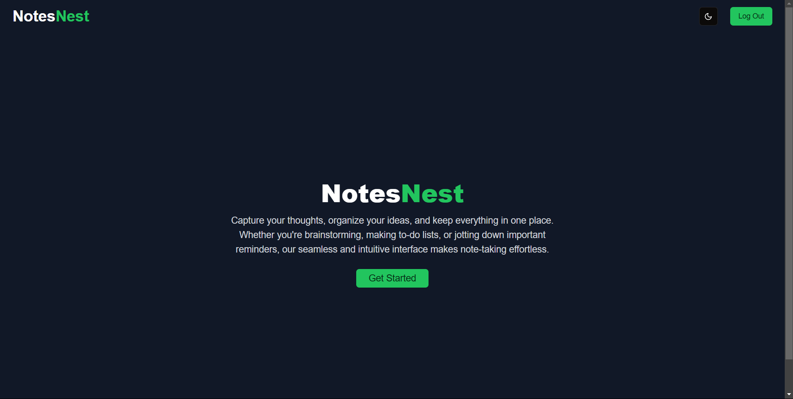

## Notes Nest

Your Next Js powered web based note taking app

## Tech Stack Used

- NextJs
- TS
- TailwindCSS
- ShadCN/UI
- Kinde (For Auth)
- Stripe (For Payments)
- Prisma (For ORM)
- PostgreSQL (For Database)

## Project Screenshots

## How to run the project

1. Clone the project
2. Run the command `pnpm i` to install relevant dependencies
3. Open .env.sample file and fill the required values
4. Enter command `pnpm run dev` and project should start on local host 3000
5. You can also use `pnpx prisma studio` to open prisma studio
